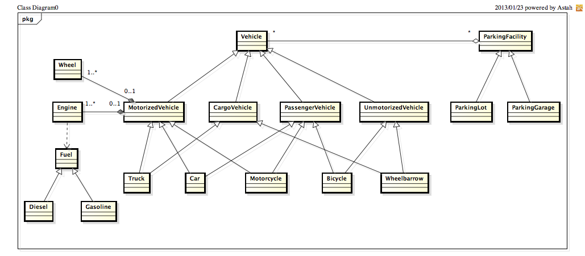

Basics of Object-Oriented Programming
=====================================

The topics discussed in this chapter are considered the basics of
object-oriented programming. Some of them are language-independent,
others are specific to C#, Java, or Scala. These topics, except
perhaps for the last two, are supposed to be covered by the
CS 1/2 prerequisite chain for this course.

.. todo:: update all examples and references --- meanwhile, please go
	  `here <http://laufer.cs.luc.edu/teaching/313/handouts/oop-basics>`_

Reference semantics vs. value semantics
---------------------------------------

- *Value semantics:* variables directly contain values.
- *Reference semantics:* variables contain addresses that refer (point)
  to objects.

Examples
^^^^^^^^

- `misc/IdentityAndEquality.java
  <https://github.com/lucoodevcourse/misc-java/tree/master/src/main/java/misc/IdentityAndEquality.java>`_
- `misc/Comparing.scala
  <https://github.com/lucproglangcourse/misc-scala/tree/master/src/main/scala/misc/Comparing.scala>`_

References
^^^^^^^^^^

- `Java <http://c2.com/cgi/wiki?JavaDoesntPassByValue>`_
- `C# <http://msdn.microsoft.com/en-us/library/ms173109.aspx>`_ (see also *Effective C#* item 6)

Equality vs. identity
---------------------

- *Equality:* are two (possibly) different objects equivalent?
- *Identity:* do two references refer to the same objects?
- How are equality and identity related?
- Reconciling value and reference semantics: identity of objects
  explained as equality of addresses.

Examples
^^^^^^^^

- `misc/IdentityAndEquality.java <https://github.com/lucoodevcourse/misc-java/tree/master/src/main/java/misc/IdentityAndEquality.java>`_
- `misc/Comparing.scala
  <https://github.com/lucproglangcourse/misc-scala/tree/master/src/main/scala/misc/Comparing.scala>`_

References
^^^^^^^^^^

- `Java
  <http://docs.oracle.com/javase/6/docs/api/java/lang/Object.html#equals(java.lang.Object)>`_
  (see also *Effective Java* items 8, 9; see also `here
  <http://www.artima.com/lejava/articles/equality.html>`_)
- `C# <http://msdn.microsoft.com/en-us/library/dd183752.aspx>`_ (see also *Effective C#* items 6, 26)

Parametric polymorphism (generics)
----------------------------------

Familiar from data structures course:

- without generics: ``Stack`` (of objects); loose typing
- without generics: ``IntStack``, ``StringStack``, ``BookStack``;
  strict typing but lots of duplicate boilerplate code
- with generics: ``Stack<Int>``, ``Stack<String>``, ``Stack<Book>``;
  strict typing without code duplication

Relatively easy to use, can be challenging to incorporate correctly in
the design of one's abstractions.

Examples
^^^^^^^^

- `misc/Comparing.java
  <https://github.com/lucoodevcourse/misc-java/tree/master/src/main/java/misc/Comparing.java>`_
- `misc/Comparing.scala
  <https://github.com/lucproglangcourse/misc-scala/tree/master/src/main/scala/misc/Comparing.scala>`_

References
^^^^^^^^^^

- `Java <http://docs.oracle.com/javase/tutorial/java/generics>`_
  (*Effective Java* chapter 5: items 23-29; see also `this tutorial
  <http://docs.oracle.com/javase/tutorial/extra/generics/index.html>`_
  and `here
  <http://www.angelikalanger.com/GenericsFAQ/JavaGenericsFAQ.html>`_
  for advanced issues)
- `C# <http://msdn.microsoft.com/en-us/library/512aeb7t.aspx>`_
- `Scala <http://docs.scala-lang.org/tutorials/tour/generic-classes.html>`_

Relationships among classes and interfaces
------------------------------------------

These are common relationships among concepts and are `part of UML\'s
class diagrams <http://en.wikipedia.org/wiki/Class_diagram#Relationships>`_.

Class/interface-level relationships
^^^^^^^^^^^^^^^^^^^^^^^^^^^^^^^^^^^

These relationships are between classes and/or interfaces, so they
*cannot* change at run time.

From strong to weak:

- *is-a*, *realizes-a*: generalization/specialization (subtyping)
- *uses-a*: dependency

Instance-level relationships
^^^^^^^^^^^^^^^^^^^^^^^^^^^^

These relationships are between instances, so they *can* change at run
time.

From strong to weak:

- *owns-a*: composition
- *part-of*: aggregation
- *has-a* or other specific relationship: association

Examples
^^^^^^^^

- `misc/Animals.java <https://github.com/lucoodevcourse/misc-java/tree/master/src/main/java/misc/Animals.java>`_
- `misc/Animals.scala
  <https://github.com/lucproglangcourse/misc-scala/tree/master/src/main/scala/misc/Animals.scala>`_
- Figure :ref:`fig_VehiclesUML`

.. _fig_VehiclesUML:

   A UML class diagram representing a taxonomy of vehicles.

Class-interface continuum
-------------------------

- *Concrete class* (C++, C#, Java, Scala): can be instantiated. All
  specified methods are fully implemented.
- *Abstract class* (C++, C#, Java, Scala): cannot be instantiated. Some
  or all of the specified methods are not implemented. A class cannot
  extend more than one abstract class.
- *Trait* (Scala only): cannot be instantiated directly. Some or all of
  the specified methods are not implemented. A class or trait can
  extend zero or more traits, and member lookup is automatically
  disambiguated based on trait order (see `traits
  <http://docs.scala-lang.org/tutorials/tour/traits.html>`_ and `mixins
  <http://docs.scala-lang.org/tutorials/tour/mixin-class-composition.html>`_
  for details).
- *Interface* (Java, C# only): limit case of a fully abstract class for
  specification purposes only. None of the specified methods are
  implemented, and there are no instance variables.

Related to the single-responsibility and interface-segregation principles.

Examples
^^^^^^^^

- `misc/Animals.java
  <https://github.com/lucoodevcourse/misc-java/tree/master/src/main/java/misc/Animals.java>`_
- `misc/Animals.scala
  <https://github.com/lucproglangcourse/misc-scala/tree/master/src/main/scala/misc/Animals.scala>`_

References
^^^^^^^^^^

- `Java
  <http://docs.oracle.com/javase/tutorial/java/IandI/abstract.html>`_
  (see also *Effective Java* items 18, 19)
- `C# <http://msdn.microsoft.com/en-us/library/ms173150.aspx>`_ (see
  also *Effective C#* items 22, 23)
- `Scala <http://docs.scala-lang.org/tutorials/tour/abstract-types.html>`_

Subtyping vs. subclassing/inheritance
-------------------------------------

- `Subtyping <http://en.wikipedia.org/wiki/Subtyping>`_ allows
  substituting a more specific object for a more
  general one, for example, when passed as an argument or assigned to
  a variable.
- `Inheritance
  <http://en.wikipedia.org/wiki/Inheritance_(computer_science)>`_ is a
  mechanism for a subclass to reuse state and  behavior from a
  superclass.

  - inherit methods and fields
  - add fields
  - add or replace/refine methods
- Inheriting from a superclass enables weak syntactic subtyping. (In
  some languages, this relationship can be public or nonpublic.)
- The `Liskov Substitution Principle (LSP)
  <http://en.wikipedia.org/wiki/Liskov_substitution_principle>`_
  defines strong semantic (behavioral) subtyping.
- Implementing or extending an interface also enables syntactic
  subtyping (and semantic subtyping because interfaces have no
  behavior). Extending a trait also enables syntactic subtyping.

Examples
^^^^^^^^

- `misc/Animals.java
  <https://github.com/lucoodevcourse/misc-java/tree/master/src/main/java/misc/Animals.java>`_
- `misc/Animals.scala
  <https://github.com/lucproglangcourse/misc-scala/tree/master/src/main/scala/misc/Animals.scala>`_

References
^^^^^^^^^^

- `Java
  <http://docs.oracle.com/javase/tutorial/java/IandI/subclasses.html>`_
  (see also *Effective Java* item 17; see also `these pitfalls
  <http://www.techrepublic.com/article/avoid-these-java-inheritance-gotchas/5031837>`_)
- `C# <http://msdn.microsoft.com/en-us/library/ms173149.aspx>`_ (see
  also *Effective C#* item 22)

Subtype polymorphism: static vs. dynamic type
---------------------------------------------

- *Static type:* declared type of a variable.
- *Dynamic type:* actual type of the object to which the variable
  refers.
- *Dynamic method binding:* ``x.f(a1, a2, ...)``. Two steps:

  #. Verify whether receiver x supports method f based on static
     type.
  #. Search for version of f to be invoked starting from dynamic type
     and proceeding upward until found.

- How are static and dynamic type of a variable related?
- If step 1 succeeds, will step 2 always succeed as well?
- *Casting:* treat an object as if it had a different static type. Three
  different situations:
  - *downcast*
  - *upcast*
  - *crosscast*
- Overloading versus overriding.
  - ``@Override``/``override`` correctness in Java and Scala

Examples
^^^^^^^^

- `misc/MethodBinding.java <https://github.com/lucoodevcourse/misc-java/tree/master/src/main/java/misc/MethodBinding.java>`_
- `misc/InterfaceCast.java <https://github.com/lucoodevcourse/misc-java/tree/master/src/main/java/misc/InterfaceCast.java>`_
- `misc/Super.java <https://github.com/lucoodevcourse/misc-java/tree/master/src/main/java/misc/Super.java>`_
- `misc/Super2.java <https://github.com/lucoodevcourse/misc-java/tree/master/src/main/java/misc/Super2.java>`_
- `misc/MethodBinding.scala
  <https://github.com/lucproglangcourse/misc-scala/tree/master/src/main/scala/misc/MethodBinding.scala>`_
- `misc/InterfaceCast.scala
  <https://github.com/lucproglangcourse/misc-scala/tree/master/src/main/scala/misc/InterfaceCast.scala>`_

References
^^^^^^^^^^

- `Java
  <http://docs.oracle.com/javase/tutorial/java/IandI/polymorphism.html>`_
  (see also *Effective Java* item 52)
- `C# <http://msdn.microsoft.com/en-us/library/ms173152.aspx>`_ (see
  also *Effective C#* item 3)

Being a good descendant of java.lang.Object/System.Object
---------------------------------------------------------

Classes are usually required to provide the following methods (these
specific ones are for Java):

- ``toString`` (for displaying instances in a meaningful way)
- ``equals`` (if an instance can be in an equivalence class that include
  other instances)
- ``hashCode`` (ditto)
- ``compareTo`` (if instances are ordered)
- ``clone`` (if instances are mutable)
- ``close`` (if instances are `closeable resources <https://docs.oracle.com/javase/tutorial/essential/exceptions/tryResourceClose.html>`_)

Also related to the Liskov substitution principle.

Examples
^^^^^^^^

- `misc/IdentityAndEquality.java <https://github.com/lucoodevcourse/misc-java/tree/master/src/main/java/misc/IdentityAndEquality.java>`_
- `misc/Comparing.java <https://github.com/lucoodevcourse/misc-java/tree/master/src/main/java/misc/Comparing.java>`_
- `misc/Comparing.scala
  <https://github.com/lucproglangcourse/misc-scala/tree/master/src/main/scala/misc/Comparing.scala>`_

References
^^^^^^^^^^

- `Java
  <http://docs.oracle.com/javase/tutorial/java/IandI/objectclass.html>`_
  (see also *Effective Java* items 8 through 12; see also `here
  <http://www.artima.com/lejava/articles/equality.html>`_ for equals,
  below for clone; detailed Javadoc is `here
  <http://docs.oracle.com/javase/7/docs/api/java/lang/Object.html>`_)
- `C# <http://msdn.microsoft.com/en-us/library/ms173149.aspx>`_ (see
  also *Effective C#* items 5, 9, 10, 27)

Clone in the context of the Composite pattern
---------------------------------------------

In general, cloning allows you to make a copy of an object. The clone
method in Java is similar to the copy constructor in C++, but it is an
ordinary method, unlike the copy constructor. Once you have the
original object and its clone, then you can modify each one
independently. Accordingly, cloning is necessary only if the objects
are mutable.

Cloning models the real-life situation where you build a prototype of
something, say a car or a piece of furniture, and once you like it,
you clone it as many times as you want. These things are composites,
and the need to be cloned deeply (recursively).

As another example, imagine a parking garage with a list of cars that
have access to it. To build another garage to handle the growing
demand, you can clone the garage and the customer access list. But the
(physical) cars should not get cloned. That's because the garage is
not composed of the cars.

As we can see, the conceptual distinction between aggregation and
composition has significant consequences for the implementation of the
relationship. True, both relationships are represented as references
in Java. However, composites usually require a deep clone (if cloning
is supported) where each parent is responsible for cloning its own
state and recursively cloning its children.

*As mentioned above, you don't need to support cloning at all if your
objects are immutable because you wouldn't be able to distinguish the
original from the clone anyway.*

References
^^^^^^^^^^

- `Java
  <http://docs.oracle.com/javase/tutorial/java/IandI/objectclass.html>`_
  (see also *Effective Java* item 11; see also `here
  <http://www.artima.com/objectsandjava/webuscript/ClonCollInner1.html>`_
  for more detail)
- `C#
  <http://msdn.microsoft.com/en-us/library/system.object.memberwiseclone.aspx>`_
  (see also *Effective C#* items 14, 27)

Packages/namespaces
-------------------

- Mechanism for grouping related or collaborating classes (cf. default
  package-level member access).
- In Java, implemented as mapping from fully qualified class names to file
  system. In Scala, this is much looser.
- In addition, in Java, each *public* class must be in a separate file whose name matches the class name.

Examples
^^^^^^^^

- `misc/Outer.java
  <https://github.com/lucoodevcourse/misc-java/tree/master/src/main/java/misc/Outer.java>`_

References
^^^^^^^^^^

- `Java <http://docs.oracle.com/javase/tutorial/java/package>`_ (see
  also `here
  <http://www.artima.com/objectsandjava/webuscript/PackagesAccess1.html>`_)
- `C# <http://msdn.microsoft.com/en-us/library/0d941h9d.aspx>`_

Member access
-------------

- public
- protected
- default (package)
- private

Related to the information hiding and open-closed principles.

References
^^^^^^^^^^

- `Java
  <http://docs.oracle.com/javase/tutorial/java/javaOO/accesscontrol.html>`_
  (see also *Effective Java* items 13, 14, 15; see also `here <http://www.artima.com/objectsandjava/webuscript/PackagesAccess1.html>`_)
- `C# <http://msdn.microsoft.com/en-us/library/ms173121.aspx>`_ (see
  also *Effective C# item 1)
