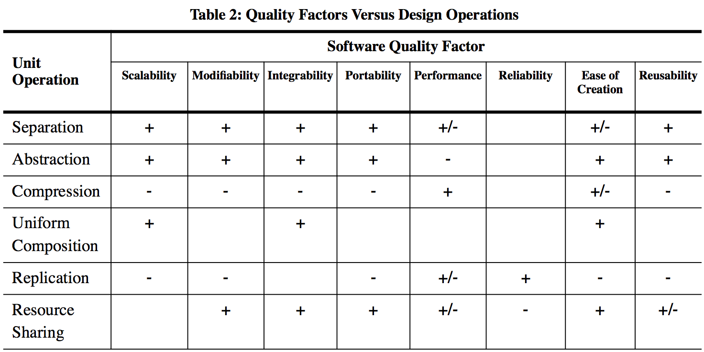

Context and Background
----------------------

In this chapter, we establish a practical context and provide some background information for the study of object-oriented programming, patterns, and principles.

Software requirements
~~~~~~~~~~~~~~~~~~~~~

In most cases, we develop software to provide some form of value:

- learn a language, library, framework, platform, technique, or tool
  (see also the `ThoughtWorks Technology Radar <https://www.thoughtworks.com/radar>`_)
- solve a problem
- produce an asset

There is usually some tension among these three activities.

The basic categories of requirements are

- functional (FR)

  - output as function of input: `y = f(x)`
  - or some other description of observable behavior

    - batch
    - interactive/event-based

- nonfunctional (NFR): additional properties of `f`, e.g.

  - testability

    - most important nonfunctional requirement
    - allows testing whether functional requirements are met
    - good architecture often happens as a side-effect (APPP pp. 36-38), such as separating I/O from core functionality

  - performance
  - scalability

    - e.g. performance for large data sets: asymptotic order of complexity
    - (big-Oh) in terms of input size n

  - reliability
  - maintainability
  - static versus dynamic NFRs

Several common questions and issues related to requirements arise:

- *how do requirements relate to the project development lifecycle?*
- *BUFD versus MVP*
- *how do testing and refactoring relate to requirements?*

The following figure by Kazman relates unit operations (high-level generalizations of refactorings) and software quality factors (nonfunctional requirements).

Overview of a lightweight development process
~~~~~~~~~~~~~~~~~~~~~~~~~~~~~~~~~~~~~~~~~~~~~

A successful development process usually comprises these minimal elements:

- `automated regression testing <https://martinfowler.com/bliki/SelfTestingCode.html>`_

  - tests represent expectations of how the software should behave
  - when expressed as code, these are

    - fun to produce (like other coding)
    - convenient to run frequently

  - fix system-under-test (SUT) (not tests themselves) until tests pass

  - retest every time

    - a feature is added

    - the code is refactored

- `refactoring <https://www.refactoring.com/>`_

  - improve the quality of the code without changing its behavior

    - macro level: nonfunctional requirements (quality factors)

    - micro level: `code smells <https://refactoring.guru/smells/smells>`_

  - `catalog of refactorings <https://refactoring.com/catalog/>`_

- `continuous integration <https://www.martinfowler.com/articles/continuousIntegration.html>`_

The `process tree <https://github.com/lucproglangcourse/processtree-scala>`_ example illustrates continuous integration using various hosted services:

- `Travis CI <https://travis-ci.org/LoyolaChicagoCode/processtree-scala>`_: continuous integration
- `Codecov <https://codecov.io/gh/LoyolaChicagoCode/processtree-scala>`_: test coverage
- `Codacy <https://www.codacy.com/app/laufer/processtree-scala>`_: automated code review
- `IssueStats <http://issuestats.com/github/LoyolaChicagoCode/processtree-scala>`_ and `IsItMaintained <http://isitmaintained.com/project/LoyolaChicagoCode/processtree-scala>`_: stats on issues and pull requests

The `click counter <https://github.com/LoyolaChicagoCode/clickcounter-android-java>`_ example includes additional hosted continuous integration and delivery targets suitable for mobile app development.

Software design principles and patterns
~~~~~~~~~~~~~~~~~~~~~~~~~~~~~~~~~~~~~~~

The software development community has identified various principles intended to guide the design and development process, for example:

- `DRY <http://en.wikipedia.org/wiki/Don%27t_repeat_yourself>`_ (don't repeat yourself)
- `SoC <https://en.wikipedia.org/wiki/Separation_of_concerns>`_ (separation of concerns)
- `SOLID <https://en.wikipedia.org/wiki/SOLID_(object-oriented_design)>`_

The community has also developed a body of `design patterns <https://sourcemaking.com/design_patterns>`_ that represent reusable solutions to recurring problems. Some key design patterns we will rely on in this course include

- Iterator
- Strategy
- Command
- Composite
- Decorator
- Visitor
- Abstract Factory
- Observer

We will study these topics throughout the course.

.. note:: Language-specific design patterns are called *idioms*.
